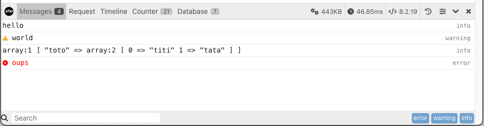

# PHP Debug Bar

   

Displays a debug bar in the browser with information from php.
No more `var_dump()` in your code!

> **Note: Debug Bar is for development use only. Never install this on websites that are publicly accessible.**

**Features:**

- Generic debug bar
- Easy to integrate with any project
- Clean, fast and easy to use interface
- Handles AJAX request
- Includes generic data collectors and collectors for well known libraries
- The client side bar is 100% coded in javascript
- Easily create your own collectors and their associated view in the bar
- Save and re-open previous requests
- [Very well documented](http://phpdebugbar.com/docs)

Includes collectors for:

- [PDO](http://php.net/manual/en/book.pdo.php)
- [CacheCache](http://maximebf.github.io/CacheCache/)
- [Doctrine](http://doctrine-project.org)
- [Monolog](https://github.com/Seldaek/monolog)
- [Propel](http://propelorm.org/)
- [Slim](http://slimframework.com)
- [Symfony Mailer](https://symfony.com/doc/current/mailer.html)
- [Swift Mailer](http://swiftmailer.org/)
- [Twig](http://twig.symfony.com/)

Checkout the [demo](https://github.com/maximebf/php-debugbar/tree/master/demo) for
examples and [phpdebugbar.com](http://phpdebugbar.com) for a live example.

Integrations with other frameworks:

- [Laravel](https://github.com/barryvdh/laravel-debugbar)
- [Atomik](http://atomikframework.com/docs/error-log-debug.html#debug-bar)
- [XOOPS](http://xoops.org/modules/news/article.php?storyid=6538)
- [Zend Framework 2](https://github.com/snapshotpl/ZfSnapPhpDebugBar)
- [Phalcon](https://github.com/snowair/phalcon-debugbar)
- [SilverStripe](https://github.com/lekoala/silverstripe-debugbar)
- [Grav CMS](https://getgrav.org)
- [TYPO3](https://github.com/Konafets/typo3_debugbar)
- [Joomla](https://github.com/joomla/joomla-cms/blob/4.0-dev/plugins/system/debug/debug.php)
- [Drupal](https://www.drupal.org/project/debugbar)
- [October CMS](https://github.com/rainlab/debugbar-plugin)
- Framework-agnostic middleware and PSR-7 with [php-middleware/phpdebugbar](https://github.com/php-middleware/phpdebugbar)
- [Dotkernel Frontend Application](https://github.com/dotkernel/dot-debugbar)

*(drop me a message or submit a PR to add your DebugBar related project here)*

